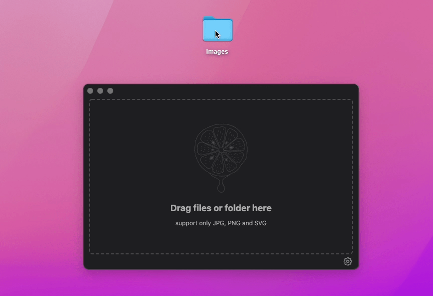

<p align="center">
  
</p>
<h1 align="center">Image Optimizer</h1>
<p align="center">
  
  
  
</p>
<p align="center">
  <strong>Built with Electron, Vue & Vite.</strong>
</p>

A free and open source tool for optimizing images and vector graphics.

<p align="center">
  
</p>

Original repo at: https://github.com/antonreshetov/image-optimizer

This fork includes:
- PNG -> WebP option
- Multi-platform release for Macos (.dmg), Linux (.snap, .AppImage) and Windows (.exe)

## How to Install Image Optimizer

1. Go to [Releases](https://github.com/christopher-hayes/image-optimizer/releases) get the latest build.

### MacOS

2. Download and run the `.dmg` file.

### Windows

2. Download and run the `.exe` file.

### Linux

2. Either download the `.snap` or the `.AppImage`.

**Linux Snap**

3. Run the bash command below inside the Downloads folder.

```Bash
sudo snap install --force-dangerous ./image-optimizer.snap
```

Replace `image-optimizer.snap` with the actual filename

**Linux AppImage**

To install the AppImage, right-click on the file > Properties > Permissions > "Allow executing file as program".

**Notes about Snap and Appimage**

Note that the Snap will move the files to `/snap/bin` and create a "Desktop file" that shows the app in global search. The AppImage does not do this - you need to create a desktop file if you want to see it in search. Additionally, this means you can delete the Snap from Downloads after installing, but the AppImage download should not be deleted unless uninstalling. The AppImage should probably be moved to a more permanent folder such as `$HOME/bin`

## How to Uninstall

### MacOS

Delete the `Image-Optimizer.dmg` file from `/Applications`

### Windows

Uninstall through Windows' "Add/Remove Programs" interface.

### Linux

**Linux Snap**

```bash
sudo snap remove image-optimizer
``` 

**Linux AppImage**

Delete the `.appimage` file.

## Core libs
 - [mozjpeg](https://github.com/mozilla/mozjpeg)
 - [pngquant](https://pngquant.org)
 - [gifsicle](https://www.lcdf.org/gifsicle/)
 - [SVGO](https://github.com/svg/svgo)

## Running and Building the source code

### Development
```bash
# install dependencies
yarn
# serve with hot reload
yarn dev
```

### Build

Run `yarn run build:local` to both build the Vue frontend and run the electron builder.

`yarn build` is used by GitHub Actions to only build the Vue frontend.

## Related
- [Electron Vue Vite Boilerplate](https://github.com/antonreshetov/electron-vue-vite-boilerplate)

Contributors: [Anton Reshetov](https://github.com/antonreshetov), [Chris Hayes](https://github.com/christopher-hayes)
