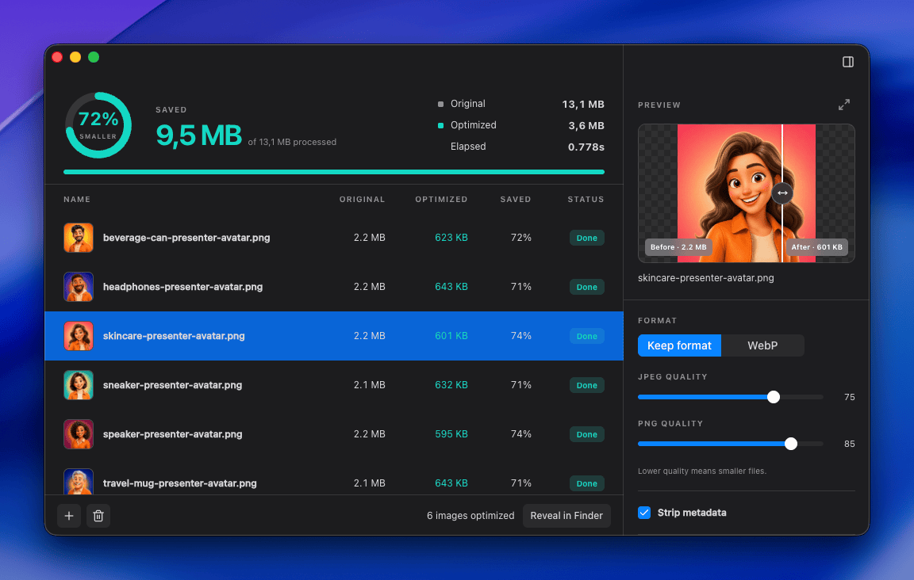

<p align="center">
  
</p>
<h1 align="center">Image Optimizer</h1>
<p align="center">
  
  
  
</p>
<p align="center">
  <strong>A fast, private desktop image optimizer.</strong>
</p>

<p align="center">
  A free and open source desktop app for compressing raster images and optimizing
  vector graphics. Files are processed locally on your computer.
</p>

<p align="center">
  
</p>

## Features

- Optimize JPEG, PNG, GIF, and SVG files in batches.
- Drop individual images or entire folders; nested folders are scanned recursively.
- Compare original and optimized images with an interactive before/after preview.
- Review per-file sizes, status, savings, total reduction, and elapsed time.
- Adjust JPEG and PNG quality before running a job.
- Convert JPEG and PNG images to WebP.
- Strip metadata and control where optimized files are written.
- Save results to a configurable output folder, add a `.min` suffix, or replace the source file.
- Reveal completed files in Finder, Explorer, or the Linux file manager.
- Download and install published updates from inside the app.

## Supported formats

| Input      | Optimizer                                     | Output       |
| ---------- | --------------------------------------------- | ------------ |
| JPEG / JPG | [mozjpeg](https://github.com/mozilla/mozjpeg) | JPEG or WebP |
| PNG        | [pngquant](https://pngquant.org)              | PNG or WebP  |
| GIF        | [gifsicle](https://www.lcdf.org/gifsicle/)    | GIF          |
| SVG        | [SVGO](https://github.com/svg/svgo)           | SVG          |

WebP conversion is powered by [cwebp](https://developers.google.com/speed/webp/docs/cwebp).

## Download

Download the latest installer from [GitHub Releases](https://github.com/antonreshetov/image-optimizer/releases).

- macOS: DMG and ZIP for Apple Silicon and Intel
- Windows: NSIS installer
- Linux: Snap package

## Development

### Requirements

- Node.js 24
- pnpm 10

Install dependencies and start the Electron app with hot reload:

```bash
pnpm install --frozen-lockfile
pnpm dev
```

### Quality checks

Run the same checks used by CI:

```bash
pnpm check
pnpm format:check
pnpm build
```

`pnpm check` runs ESLint, TypeScript checks, and the Vitest test suite.

### Packaging

Build an unpacked application directory:

```bash
pnpm package
```

Platform-specific packages can be created with:

```bash
pnpm package:mac
pnpm package:win
pnpm package:linux
```

For an unsigned, non-notarized macOS package suitable for local testing, run:

```bash
pnpm package:mac:local
```

Generated packages are written to `dist`.

## Tech stack

- Electron
- Vue 3
- TypeScript
- Vite
- Tailwind CSS and shadcn-vue
- Vitest

## Related

- [Electron Vue Vite Boilerplate](https://github.com/antonreshetov/electron-vue-vite-boilerplate)

Copyright (c) 2021-present, Anton Reshetov.
