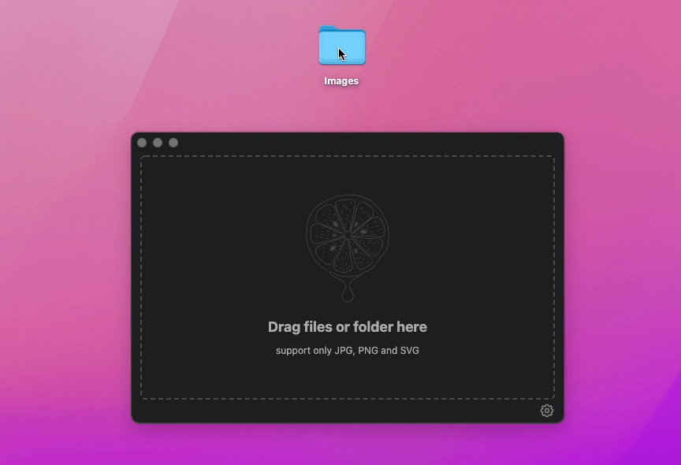

<p align="center">
  
</p>
<h1 align="center">Image Optimizer</h1>
<p align="center">
  
  
  
</p>
<p align="center">
  <strong>Built with Electron, Vue & Vite.</strong>
</p>

A free and open source tool for optimizing images and vector graphics.

<p align="center">
  
</p>

## Core libs

- [mozjpeg](https://github.com/mozilla/mozjpeg)
- [pngquant](https://pngquant.org)
- [cwebp](https://developers.google.com/speed/webp/docs/cwebp)
- [gifsicle](https://www.lcdf.org/gifsicle/)
- [SVGO](https://github.com/svg/svgo)

## Download and Installation on macOS

Go to [Releases](https://github.com/antonreshetov/image-optimizer/releases) get the latest build, download and install.

## Development

```bash
pnpm install --frozen-lockfile
pnpm dev
```

Before opening a pull request, run the same checks used by CI:

```bash
pnpm check
pnpm format:check
pnpm build
```

## Local macOS package

Create macOS installers for local testing:

```bash
pnpm package:mac:local
```

The generated files are written to `dist`.

## Release process

1. Update the version and create a `v*` tag (for example, `v1.5.0`) that points to the commit to release.
2. Push the tag, or run the **Release** workflow manually and provide an existing `v*` tag.
3. The workflow builds Windows and Linux packages and both Intel (`x64`) and Apple Silicon (`arm64`) macOS packages.
4. After every platform succeeds, the workflow creates a draft GitHub Release and attaches installers, updater YAML files, and blockmaps. Review the draft and publish it manually.

Draft releases are not visible to the application's auto-updater. Update metadata and downloadable installers become visible only after the draft is published.

## Related

- [Electron Vue Vite Boilerplate](https://github.com/antonreshetov/electron-vue-vite-boilerplate)

Copyright (c) 2021-present, Anton Reshetov.
