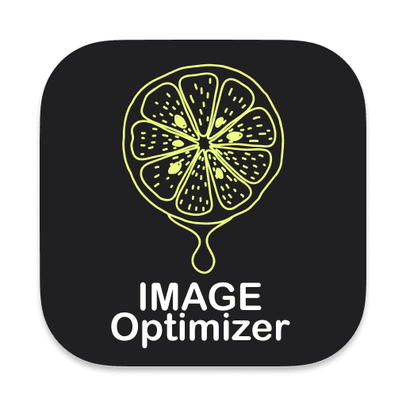

<p align="center">
  
</p>
<h1 align="center">Image Optimizer</h1>
<p align="center">
  
  
  
</p>
<p align="center">
  <strong>Built with Electron, Vue & Vite.</strong>
</p>

A free and open source tool for optimizing images and vector graphics.

<p align="center">
  
</p>


## Core libs
 - [mozjpeg](https://github.com/mozilla/mozjpeg)
 - [pngquant](https://pngquant.org)
 - [cwebp](https://developers.google.com/speed/webp/docs/cwebp)
 - [gifsicle](https://www.lcdf.org/gifsicle/)
 - [SVGO](https://github.com/svg/svgo)

## Download and Installation on macOS

Go to [Releases](https://github.com/antonreshetov/image-optimizer/releases) get the latest build, download and install.

## Development
```bash
# install dependencies
yarn
# serve with hot reload
yarn dev
```

## Build
```bash
# build application for production
yarn build
```

## Related
- [Electron Vue Vite Boilerplate](https://github.com/antonreshetov/electron-vue-vite-boilerplate)

Copyright (c) 2021-present, Anton Reshetov.
